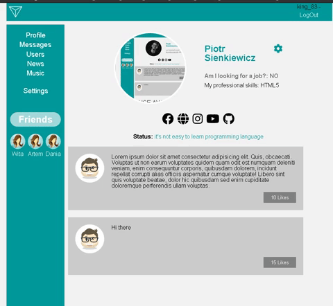
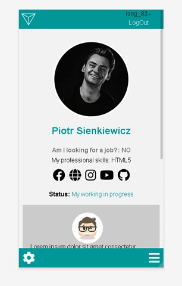
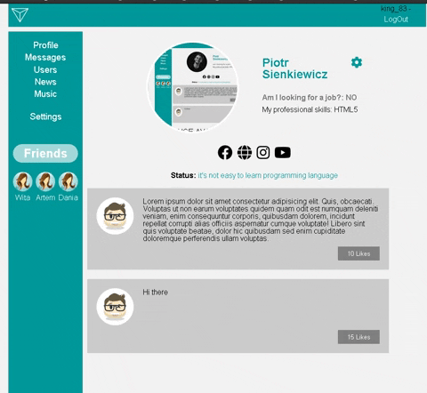
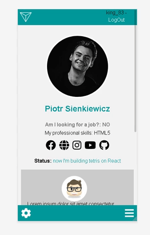

<h1 align='center'> BUILDING A SOCIAL NETWORK (PRACTICE)</h1>

  

#### *social network in miniature - is a best practice to learn how to use React, Redux, REST.API*  

## [View a Demo](https://dev-soc-network.netlify.app/#/profile/8480)

____________________________________________________________________
## What stack?
**- React**  
**- React-router**  
**- React-hooks**  
**- Redux**  
**- Redux-thunk**  
**- Redux-hooks**  
**- AJAX**  
**- SASS**  
**- HTML5**  
____________________________________________________________________

## Description

It's a platform for practice, not for build new brand facebbok.  

I used simple free API with users, where I can: 
- build my profile
- follow/unfollow users
- change status
- change links for social networks
- add avatar
- load users
- login/logout
- use simple captcha, when I write wrong email or pass repeatedly
____________________________________________________________________

**CHANGING AVATAR**
  
  

  

**CHANGING STATUS**
  
  

  

**ADD LINK, FOR EXAMPLE, ON GITHUB**
  
  

  

**HOW IT WORKS**
  
  

  

## About the project

It's not my project. This API is creates a tough guy from Belarus. [deep and cool tutorials](https://www.youtube.com/playlist?list=PLcvhF2Wqh7DNVy1OCUpG3i5lyxyBWhGZ8) I learned from his tutorials, but a lot of his code is outdated, and I rewrite  a lot of things to new code using new tools, such as hooks or formic instead redux-form (it's easier).
It's a long project for my practice. If you notice, some page is not ready.

## Future scope
- add **news**, **settings**, posibly music.
- add a simple search for users.
- rewrite this code on **typescript**.
